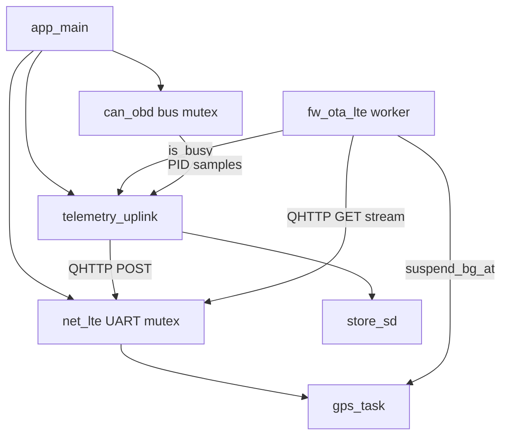

# Critical-path review + proposed comments

**Date:** 2026-08-26  
**Scope:** `main/app_main.c`, `net_lte`, `fw_ota_lte`, `telemetry_uplink`, `can_obd` (~4.2k LOC)  
**Method:** Working-tree review (includes uncommitted local diffs) + prior bench validation  
**Source edits:** None in this pass — comments below are paste-ready proposals only

> **Errata (2026-09-01):** Finding **D1** (stale `PPP/Internet still TODO` log) is fixed —
> `net_lte` now reports `UART AT OK; HTTP via QHTTP (no PPP)`. LTE OTA uses
> `ota_pend` → boot verify → `ota_applied` (`fw_ota_lte_commit_pending_applied` in
> `app_main`). Zigbee host path is documented in `docs/fleet-zigbee-host-guide.md`
> (open network, no install codes).

---

## 1. Executive verdict

The architecture is coherent and matches the product: MCP2515 OBD → telemetry bus → SD queue → EC200U QHTTP; Trafyn LTE OTA streams into the inactive OTA bank; SoftAP/serial for local control.

**What is sound**

- Boot order: NVS → OTA stacks → profiles/bus → LTE auto-check → SPI/CAN → SD → uplink → transports → confirm → poller.
- UART AT/HTTP serialized on one mutex; GNSS cache on a separate mutex.
- Offline CAN (`TX not acked`, `can_ready=no`) is expected without a truck — not a defect.
- GPS works with antenna sky view (bench: fix after cold start); cellular HTTP/OTA check works (HTTP 200 `no_update`).
- Uplink correctly skips with `gps stationary` / `no pid or gps`; HTTP ack only on 2xx.
- Host unit tests for policy/codec/isotp/payload/OTA parse pass (existing binaries).

**What needs attention before or during today’s review**

| Severity | Topic |
|----------|--------|
| **Blocker** | `ota_applied` persisted before `fw_ota_end_and_reboot` / boot verify — can block retry/rollback |
| **Should-fix** | Uncommitted `produce_once` OTA gate drops **SD enqueue** during OTA (drain-only gate is enough) |
| **Should-fix** | `AT+QGPS=1` treats only CME **504** as success; bare `+CME ERROR` fails enable loop (bench still got a fix later via poll path) |
| **Should-fix** | `fw_ota_lte_run` does not call `net_lte_suspend_bg_at` — only `lte_ota_task` does |
| **Should-fix** | MCP2515 programs only RXF0/RXF2; unused filters stay reset-default (11-bit junk RX risk) |
| **Nit** | Stale logs/comments: “PPP still TODO”, SoftAP “.bin upload” in `app_main` |

**Uncommitted working-tree (not on Bitbucket/GitHub yet)**

- `net_lte`: `net_lte_suspend_bg_at` + GPS task pause
- `fw_ota_lte`: 3× bin stream retry; suspend wrap in `lte_ota_task`
- `telemetry_uplink`: early `fw_ota_lte_is_busy()` in `produce_once`

These are directionally good except the produce-once gate is too broad (see finding U1).

---

## 2. Architecture / concurrency



| Mechanism | Role |
|-----------|------|
| `s_uart_mutex` | All AT / QHTTP; held up to 120–300 s for HTTP |
| `s_suspend_bg_at` | GPS task skips AT during OTA worker (uncommitted) |
| `fw_ota_lte_is_busy()` | Uplink produce/drain skip while CHECKING/DOWNLOADING/REBOOTING or worker alive |
| `s_bus_mutex` | Single-flight CAN ISO-TP |
| `s_gps_mutex` | GNSS cache read without blocking behind HTTP |

Boot assumptions that hold today: SD mount before `telemetry_uplink_start` (drain task only if mounted at start); LTE started before auto-OTA and uplink; SoftAP before `fw_ota_confirm_after_boot`.

---

## 3. Findings (severity-tagged)

### Blocker

| ID | File / function | Evidence |
|----|-----------------|----------|
| **B1** | `fw_ota_lte.c` / `fw_ota_lte_run` | `save_applied_version()` runs **before** `fw_ota_end_and_reboot()`. If end/set_boot fails, or image rolls back after reboot, NVS `ota_applied` still matches `latestVersion` → next check takes `NO_UPDATE` and never retries. |

### Should-fix

| ID | File / function | Evidence |
|----|-----------------|----------|
| **U1** | `telemetry_uplink.c` / `produce_once` | Early OTA busy return skips **SD enqueue**. Drain already yields the modem. Enqueue does not need UART; during multi-minute OTA, samples are discarded instead of queued. Prefer gate only live POST / drain. |
| **N1** | `net_lte.c` / `gps_enable_once` | Success only if `OK` or CME contains `504`. Bench saw bare `+CME ERROR` for 40 attempts, then a fix anyway — enable reporting is misleading; consider logging full CME code and treating other “already on” codes. |
| **N2** | `net_lte.c` / `ensure_pdp_locked` | `QIACT=1` ERROR logged even when IP already up (expected “already active”). Self-test reports PDP FAIL while IP present — confusing, not necessarily broken. |
| **O1** | `fw_ota_lte.c` / `fw_ota_lte_run` vs `lte_ota_task` | Suspend BG AT only in task wrapper. Direct `fw_ota_lte_run()` races GPS AT. |
| **O2** | `fw_ota_lte.c` / `ensure_auto_config` | Auto path **persists** `force=false`, wiping SoftAP/serial force-reflash preference. |
| **O3** | `fw_ota_lte.c` / stream retry | Retries same presigned URL; `bytes_downloaded` not reset per attempt; no Content-Length vs expected size check. |
| **O4** | Shared NVS `uplink_did` | OTA and uplink each keep RAM caches; SoftAP edit of one does not refresh the other until reboot. |
| **C1** | `mcp2515.c` / `mcp2515_configure` | Only RXF0 + RXF2 written; other filters remain 0 after reset → 11-bit mask can accept junk IDs into RX buffers. |
| **C2** | `can_obd.c` / `can_obd_transact` | Mutex `ESP_ERR_TIMEOUT` counted toward consecutive link failures → false re-detect under contention. |
| **C3** | `mcp2515_tx_done` | TXREQ clear ≠ bus ACK (also clears on bus-off); can look like “acked” then `NOT_FOUND`. |
| **U2** | `telemetry_uplink.c` | Static payload/peek buffers shared across produce/drain/`send_now` without a produce–drain mutex. |
| **U3** | `drain_once` | HTTP 400 correctly keeps queue — but permanent schema poison blocks head forever (no DLQ). Bench saw status 400. |

### Nit / docs

| ID | Evidence |
|----|----------|
| **D1** | `bringup_task`: still logs `PPP/Internet still TODO` while QHTTP path is production. |
| **D2** | `app_main.c` SoftAP comment still mentions “.bin upload”; SoftAP is stats/config only. |
| **D3** | Header comment in `app_main` says MCP on “SPI2 shared with SD”; later comment correctly says soft-SPI vs HW SPI2 on separate GPIOs. |
| **D4** | `fw_ota_lte_parse.c` / `obd_isotp.c`: almost no design comments (headers better for isotp). |
| **D5** | `channel` NVS field unused in Trafyn check POST. |
| **D6** | `net_lte_reconnect` is just `net_lte_start()` (weak reconnect). |

### Not defects (for reviewers)

- CAN `TX not acked` / `no ECU found` with truck disconnected.
- Uplink `gps stationary` when fix holds and device is parked.
- `QIACT ERROR` when PDP already active, if `QIACT?` still yields IP.
- Host CMake regenerate looking for wrong `cJSON` path — build-env issue, not device logic.

---

## 4. Per-function proposed comments

Paste-ready Doxygen-style blocks. Prefer putting these **above the definition** in `.c` (and shorten public ones in `.h` if desired). Do **not** narrate obvious lines — keep *why*, contracts, concurrency, failures.

### 4.1 `main/app_main.c`

```c
/**
 * @brief CAN link supervisor: enable obd_poller when ECU answers; pause on link loss.
 * @note Historical task name "bonded_boot"; BLE path removed. Polls can_obd_is_ready.
 */
static void can_boot_task(void *arg);

/**
 * @brief Fleet telematics entry from the active OTA slot (ota_0 or ota_1).
 * @note Boot order: NVS → fw_ota* → profiles/bus → LTE+auto OTA → SPI/CAN → SD →
 *       uplink → serial/SoftAP → OTA confirm → poller → can_boot. Soft failures
 *       (LTE/SD/SoftAP) continue; NVS/sys_runtime/serial/poller are hard-checked.
 */
void app_main(void);
```

### 4.2 `net_lte` — public (`net_lte.h`)

```c
/**
 * @brief Start UART1 + background modem bring-up (and GPS task if enabled).
 * @return ESP_OK, ESP_ERR_NOT_SUPPORTED if disabled, or init errors.
 * @note Non-blocking: AT probing runs in lte_bringup. Pins: TX=CONFIG TX GPIO, RX=RX GPIO.
 */
esp_err_t net_lte_start(void);

/**
 * @brief Copy cached modem status (SIM/reg/CSQ/APN/IP/last_error).
 */
esp_err_t net_lte_get_status(net_lte_status_t *out);

/**
 * @brief Re-query CPIN/CSQ/COPS/CxREG/CGATT over AT (takes UART mutex each command).
 */
esp_err_t net_lte_refresh(void);

/**
 * @brief Blocking self-test: AT → SIM → register → PDP → optional ping; fills @p report.
 * @note Holds UART mutex up to ~120s. PDP "FAIL" with IP present often means already active.
 */
esp_err_t net_lte_selftest(char *report, size_t report_len);

/**
 * @brief Soft reconnect helper (currently re-enters net_lte_start).
 */
esp_err_t net_lte_reconnect(void);

/**
 * @brief Copy age-gated GNSS cache; gps_ok false if never fixed or older than max age.
 * @note Uses s_gps_mutex — does not wait on in-flight HTTP.
 */
esp_err_t net_lte_gps_get(net_lte_gps_t *out);

/**
 * @brief HTTPS POST JSON via QHTTP (2xx = success). Serializes on UART mutex.
 */
esp_err_t net_lte_http_post(const char *url, const char *body, net_lte_http_result_t *out);

/**
 * @brief HTTPS POST with optional custom headers and optional response body capture.
 * @note When resp_buf non-NULL, streams QHTTPREAD into buffer; else short-drain.
 */
esp_err_t net_lte_http_post_recv(...);

/**
 * @brief HTTPS GET into a small buffer (manifest-sized). Holds mutex up to ~300s.
 */
esp_err_t net_lte_http_get(...);

/**
 * @brief HTTPS GET streaming for large bodies (OTA .bin); invokes chunk callback.
 * @note Does not buffer the full body in RAM.
 */
esp_err_t net_lte_http_get_stream(...);

/**
 * @brief Pause GPS (and other BG AT) while LTE OTA owns the modem UART.
 * @note Only gps_task honors this today; other at_transact callers still contend via mutex.
 */
void net_lte_suspend_bg_at(bool suspend);
```

### 4.3 `net_lte.c` — static / enabled path

```c
/**
 * @brief Raw AT write + collect until OK/ERROR/READY or timeout (caller holds UART mutex).
 * @note Drains stale UART bytes first. Returns ESP_OK when a terminator is seen (even ERROR).
 */
static esp_err_t at_transact_locked(...);

/**
 * @brief Take UART mutex then at_transact_locked; timeout includes mutex wait slack.
 */
static esp_err_t at_transact(...);

/**
 * @brief Install/configure UART1 once (large RX buffer for QHTTP bodies).
 */
static esp_err_t uart_init(void);

/**
 * @brief Background: retry AT/ATI then refresh registration; deletes self when done.
 * @note Sets stale last_error "PPP not implemented" even when QHTTP works — update messaging.
 */
static void bringup_task(void *arg);

/**
 * @brief Parse +CSQ into s_status.csq and rssi_dbm.
 */
static void parse_csq(const char *resp);

/**
 * @brief Parse quoted operator name from +COPS.
 */
static void parse_cops(const char *resp);

/**
 * @brief Parse +QGPSLOC: UTC,lat,lng,... (decimal degrees, mode 2).
 */
static bool parse_qgpsloc(...);

/**
 * @brief One AT+QGPS=1 attempt; true on OK or CME 504 (already enabled).
 */
static bool gps_enable_once(...);

/**
 * @brief Enable GNSS with backoff, then poll QGPSLOC; honors s_suspend_bg_at.
 * @note On CME 505 (inactive), re-enables. Fix can appear even if enable loop "failed".
 */
static void gps_task(void *arg);

/**
 * @brief Collect UART bytes for a fixed window (no token); used for URC tails / ping.
 */
static esp_err_t at_collect_locked(...);

/**
 * @brief Wait until @p token or ERROR appears in the response buffer.
 */
static esp_err_t at_wait_token_locked(...);

/**
 * @brief Ensure PDP: QICSGP + QIACT=1 (ERROR OK if already up) + parse IP from QIACT?.
 * @return ESP_OK if IP present; ESP_FAIL otherwise.
 */
static esp_err_t ensure_pdp_locked(...);

/**
 * @brief QHTTPURL length handshake: wait CONNECT, write URL, wait OK.
 */
static esp_err_t http_set_url_locked(...);

/**
 * @brief Shared GET setup: PDP, SSL/HTTP cfg, URL, QHTTPGET URC → status/content-length.
 */
static esp_err_t http_prepare_get_locked(...);

/**
 * @brief After CONNECT, stream body to callback; skip leading CRLF so CL matches.
 * @note Known content_len path is strict; unknown length uses idle timeout.
 */
static esp_err_t http_read_body_stream_locked(...);

/**
 * @brief Chunk callback that appends into a fixed buffer (NUL-terminated).
 */
static esp_err_t http_get_buf_cb(...);

/**
 * @brief Split http(s)://host/path?query into host and path_and_query.
 */
static esp_err_t http_parse_url_host_path(...);
```

*(Disabled-`CONFIG_NET_LTE_ENABLE` stubs: document as returning `ESP_ERR_NOT_SUPPORTED` / empty GPS.)*

### 4.4 `fw_ota_lte` — public

```c
/**
 * @brief Create OTA mutex; load NVS config and ota_applied; phase IDLE.
 * @note Call once before other APIs (no NULL guard on s_mu elsewhere).
 */
esp_err_t fw_ota_lte_init(void);

esp_err_t fw_ota_lte_get_config(fw_ota_lte_config_t *out);
/**
 * @brief Replace config, sanitize legacy lab URLs, persist (incl. uplink_did).
 * @note Does not refresh telemetry_uplink's in-RAM device_id.
 */
esp_err_t fw_ota_lte_set_config(const fw_ota_lte_config_t *in);
esp_err_t fw_ota_lte_get_status(fw_ota_lte_status_t *out);

/**
 * @brief Blocking Trafyn check → optional stream/flash/reboot.
 * @warning Does NOT suspend BG AT; prefer start_background. May save ota_applied
 *          before reboot verify (see finding B1). Does not return on successful reboot.
 */
esp_err_t fw_ota_lte_run(void);

/**
 * @brief Spawn worker: suspend_bg_at → run → resume. Rejects if s_task or fw_ota busy.
 */
esp_err_t fw_ota_lte_start_background(void);

/**
 * @brief Start periodic auto-check task (wait LTE → background OTA → sleep hours).
 */
esp_err_t fw_ota_lte_start_auto(void);

/**
 * @brief True if phase CHECKING/DOWNLOADING/REBOOTING or worker task alive.
 */
bool fw_ota_lte_is_busy(void);
```

### 4.5 `fw_ota_lte.c` — static

```c
/** @brief Update phase/error under caller-held s_mu. */
static void set_phase(...);
/** @brief Fill empty manifest_url from Kconfig CHECK_URL. */
static void apply_default_url(...);
/** @brief Detect legacy ngrok / /firmware/manifest check URLs. */
static bool check_url_is_legacy_lab(...);
/** @brief Replace legacy URL with Kconfig default; return true if rewritten. */
static bool sanitize_check_url(...);
/** @brief Zero config + demo defaults. */
static void defaults(...);
/** @brief Load NVS into s_cfg/s_applied; may rewrite legacy URL. */
static esp_err_t load_nvs(void);
/**
 * @brief Persist ota_applied + RAM s_applied.
 * @warning Call only after successful boot verify (today called pre-reboot — B1).
 */
static esp_err_t save_applied_version(...);
/** @brief Persist URL/channel/force/device_id (uplink_did). */
static esp_err_t save_nvs(...);
/** @brief Stream chunk → fw_ota_write; bump bytes_downloaded under mutex. */
static esp_err_t stream_write_cb(...);
/** @brief Worker: suspend BG AT, fw_ota_lte_run, resume, clear s_task. */
static void lte_ota_task(void *arg);
/** @brief Poll net_lte_refresh until registered or timeout. */
static bool wait_lte_registered(...);
/**
 * @brief Ensure URL; if force set, clear and persist (see O2 — prefer local-only clear).
 */
static void ensure_auto_config(void);
/** @brief One auto cycle: start_background and wait until not busy. */
static void auto_check_once(void);
/** @brief Infinite auto-check loop with interval sleep. */
static void lte_ota_auto_task(void *arg);
```

### 4.6 `fw_ota_lte_parse`

```c
/**
 * @brief Strip first "-suffix" from version for Trafyn currentVersion compare.
 * @note Only first dash; "1.0.4-rc.1" → "1.0.4".
 */
void fw_ota_strip_version(...);

/**
 * @brief Parse Trafyn check JSON → UPDATE / NO_UPDATE / FAIL.
 * @param stripped_current Must be non-NULL (else UB on strcmp).
 * @note UPDATE needs updateAvailable, version≠current, URL, 64-hex sha256, size>0.
 */
int fw_ota_parse_check_json(...);

/** @brief True if exactly 64 hex chars. */
static bool sha256_valid(const char *s);
/** @brief Mark FAIL with truncated message. */
static void set_fail(...);
```

### 4.7 `telemetry_uplink` — public

```c
/**
 * @brief Start cache + tick (+ drain if SD mounted at boot). Idempotent.
 * @note Drain task is not created if SD mounts later.
 */
esp_err_t telemetry_uplink_start(void);
esp_err_t telemetry_uplink_get_config(...);
/**
 * @brief Validate, save NVS elm/uplink_*, update RAM (shares uplink_did with OTA).
 */
esp_err_t telemetry_uplink_set_config(...);
esp_err_t telemetry_uplink_get_status(...);
/** @brief One produce; notify drain and best-effort drain_once if applicable. */
esp_err_t telemetry_uplink_send_now(void);
/** @brief Lab: enqueue minimal event and kick drain (bypasses PID/GPS gates). */
esp_err_t telemetry_uplink_queue_test_enqueue(void);
```

### 4.8 `telemetry_uplink.c` — static

```c
static uint64_t now_ms(void);
/** @brief Update GPS-only dedup last lat/lng/time when snap has fix. */
static void remember_gps_if_ok(...);
/** @brief Record last produce/drain diagnostic (SoftAP/serial). */
static void set_last(...);
static void set_drain_err(const char *msg);
static void cfg_defaults(...);
static esp_err_t cfg_load(void);
static esp_err_t cfg_save(...);
/** @brief Cache rpm/speed/coolant/throttle/voltage samples from bus. */
static void store_sample(...);
static void cache_task(void *arg);
static void fill_pid_view(...);
/** @brief Any PID fresh within UPLINK_PID_FRESH_MS (caller holds s_mu). */
static bool any_fresh_ok_locked(...);
/** @brief Snapshot: cached PIDs + GNSS cache + ids/metrics. */
static esp_err_t build_snapshot(...);
/**
 * @brief Produce tick: gates → JSON → SD enqueue or live POST.
 * @warning Early OTA busy gate currently skips SD enqueue (U1) — should only block modem use.
 */
static esp_err_t produce_once(void);
/**
 * @brief Peek SD batch, POST array; ack bytes only on HTTP 2xx (400 keeps head).
 */
static esp_err_t drain_once(void);
static void tick_task(void *arg);
/** @brief Wait notify/backoff; skip if OTA busy; drain_once with backoff. */
static void drain_task(void *arg);
```

### 4.9 `uplink_payload`

```c
/** @brief Live body {"schemaId","payload"}; length or -1. */
int uplink_payload_build(...);
/** @brief Inner payload object only (PIDs, gps, device/node ids). */
int uplink_payload_build_payload(...);
/** @brief NDJSON queue line with queued_at_ms. */
int uplink_payload_build_queued_event(...);
/** @brief Batch array re-wrapping each queued payload with schemaId. */
int uplink_payload_build_batch(...);
bool uplink_pid_is_fresh_ok(...);
/** @brief Enqueue if fresh OBD PID or live GPS. */
bool uplink_should_enqueue(...);
double uplink_gps_distance_m(...);
/** @brief GPS-only: first fix, ≥50 m move, or 5 min heartbeat. */
bool uplink_gps_only_worth_sending(...);

static int append(...);
static int appendf(...);
/** @brief JSON string escape (quotes/backslashes). */
static int append_json_str(...);
/** @brief Emit PID fields when fresh-ok; always emit <ok> bool (never null). */
static int append_pid_fields(...);
/** @brief Brace-match object after "payload": in a queue line. */
static int extract_payload_object(...);
```

### 4.10 `can_obd` — public

```c
/** @brief Create bus mutex; soft-SPI init + MCP2515 detect (CANSTAT). */
esp_err_t can_obd_init(void);
/** @brief Start link_task (detect / reprobe). */
esp_err_t can_obd_start(void);
bool can_obd_is_ready(void);
/**
 * @brief Hex OBD cmd → hex ISO-TP payload (single-flight mutex).
 * @return ESP_FAIL TX not acked (offline bus); ESP_ERR_NOT_FOUND acked but no data;
 *         ESP_ERR_TIMEOUT mutex busy.
 */
esp_err_t can_obd_transact(...);
/** @brief Active protocol name or "none". */
void can_obd_get_protocol(...);
```

### 4.11 `can_obd.c` — static

```c
static uint64_t now_ms(void);
/** @brief Map response ID → physical TX ID for ISO-TP FC. */
static uint32_t fc_dest_id(...);
/** @brief Soft accept: id matches protocol filter/mask. */
static bool resp_id_matches(...);
/**
 * @brief Locked SF TX + SF/FF/CF RX; send FC on NEED_FC.
 * @note Offline: abort after 250 ms, log TEC/REC/EFLG, ESP_FAIL.
 */
static esp_err_t transact_locked(...);
static esp_err_t apply_protocol(int idx);
static void save_protocol_nvs(int idx);
static int load_protocol_nvs(void);
/** @brief Kconfig pin index or -1 for auto. */
static int pinned_protocol(void);
/** @brief Configure candidate; probe 0100 expect 4100…. */
static bool probe_candidate(int idx);
/** @brief Pin → NVS-first → full sweep. */
static int detect_protocol(void);
/** @brief Detect when down; backoff; re-detect after consecutive TX fails. */
static void link_task(void *arg);
```

### 4.12 `obd_isotp`

```c
static int hex_nibble(char c);
/** @brief Build padded 8-byte SF from hex cmd (max 7 data bytes). */
int obd_isotp_build_sf(...);
void obd_isotp_rx_reset(...);
/**
 * @brief Feed one CAN frame: SF complete / FF→NEED_FC / CF assemble.
 * @note Payloads >64 ignored (no Overflow FC); fine for typical OBD.
 */
obd_isotp_rx_status_t obd_isotp_rx_feed(...);
int obd_isotp_payload_hex(...);
/** @brief CTS FC, BS=0, STmin=0. */
void obd_isotp_build_fc(...);
```

### 4.13 `mcp2515`

```c
static int xtal_index(void);
static uint8_t soft_spi_byte(uint8_t out);
/** @brief CS-framed Mode 0 transfer (spi_clock_hz currently ignored — bitbang rate). */
static void soft_spi_xfer(...);
static esp_err_t spi_cmd(uint8_t cmd);
static uint8_t read_reg(uint8_t reg);
static void read_regs(...);
static void write_reg(...);
static void write_regs(...);
static void bit_modify(...);
static void pack_id(...);
static bool unpack_rx_id(...);

/**
 * @brief GPIO + RESET + verify config-mode CANSTAT (detect).
 */
esp_err_t mcp2515_init(...);
/**
 * @brief Bit timing, masks, RXF0/RXF2, Normal mode.
 * @warning Unused RXFn left at reset defaults — program all filters (C1).
 */
esp_err_t mcp2515_configure(...);
/** @brief Load TXB0 + RTS (does not wait for ACK). */
esp_err_t mcp2515_send(...);
/**
 * @brief TXREQ clear — finished, aborted, or bus-off cleared request (not pure ACK).
 */
bool mcp2515_tx_done(void);
void mcp2515_tx_abort(void);
bool mcp2515_receive(...);
void mcp2515_read_errors(...);
```

---

## 5. Suggested reviewer walk order (today)

1. `net_lte.c` — mutex, PDP/QIACT, QHTTP stream, GPS enable/suspend  
2. `fw_ota_lte.c` + parse — **B1**, suspend, stream retries, force/NVS  
3. `telemetry_uplink.c` + payload — **U1**, stationary, 400 ack, schema  
4. `can_obd` → isotp → mcp2515 — offline TX fail, filters **C1**  
5. `app_main.c` — boot vs assumptions; stale SoftAP upload comment  

---

## 6. Follow-up backlog

### Pass 2 completed (2026-08-26)

Function comments added for the remaining `app_main` boot dependencies (comments only):

| Component | Role in boot story |
|-----------|-------------------|
| `sys_runtime` | WDT / metrics |
| `fw_ota` | Dual-bank flash writer + confirm |
| `profile_store` / `telemetry_bus` | Profiles + PID pub/sub |
| `store_sd` | microSD uplink queue + SPI lock |
| `obd_poller` / `cmd_policy` / `obd_codec` | Poll, safety, decode |
| `transport_serial` / `transport_http` / `http_api` | USB console + SoftAP REST |

Together with pass 1 (critical path), a reader can follow **end-to-end from `app_main`**.

Optional later: examples (`mcp2515_smoke`, `sd_smoke`), host tests, deeper narrative inside large HTTP handlers.

| Item | Status |
|------|--------|
| Apply comments (pass 1 + 2) | Done |
| Fix B1 / U1 / C1 | Done in working tree |
| Commit / push | Pending user request |

---

## 7. Bench cross-check (2026-08-25)

| Check | Result |
|-------|--------|
| MCP2515 SPI detect | PASS (`CANSTAT=0x80`) |
| CAN ECU (no truck) | Expected fail |
| microSD | PASS (enqueue qtest OK) |
| LTE Airtel / HTTP OTA check | PASS (200, no_update 1.0.10) |
| GNSS indoor → window | PASS fix `12.938710, 77.690370` |
| Uplink cloud POST | HTTP 400 (API/payload; UART path OK) |
| SoftAP | Up in logs; Mac not joined |

---

*End of critical-path review document. No source files were modified.*
